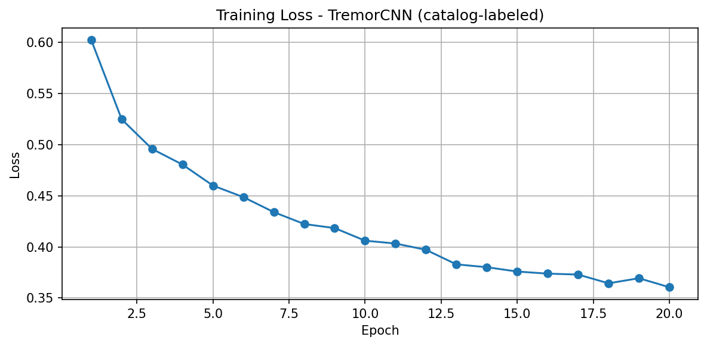
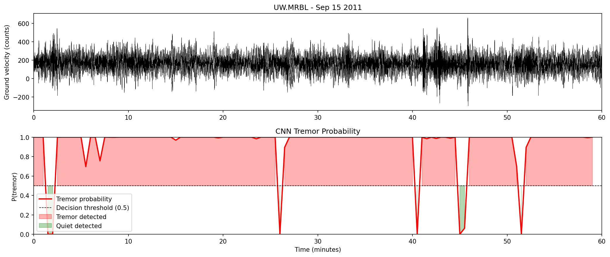

# TremorCNN - Low-Frequency Tremor Detection with Deep Learning

A convolutional neural network that detects tectonic tremor in real seismic 
waveform data fetched live from the EarthScope/IRIS archive. Built as a 
proof-of-concept for automated tremor detection on the Cascadia subduction zone.

---

## What is Tectonic Tremor?

Tectonic tremor is a weak, sustained seismic signal (1-8 Hz) generated by slow 
slip along fault boundaries. In Cascadia, tremor episodes occur every ~12-14 months 
and are closely linked to slow slip events that load stress onto the locked fault 
zone capable of producing a magnitude 9+ megathrust earthquake. Detecting tremor 
automatically across years of continuous data is a key open problem in seismology.

---

## Approach

```
Real waveform (IRIS/EarthScope)
        ↓
Bandpass filter (1-8 Hz)
        ↓
Short-Time Fourier Transform → spectrogram patch (45 x 10)
        ↓
2D CNN binary classifier (tremor / no tremor)
        ↓
Predicted label + confidence
```
Labels are derived from the PNSN/Wech tremor catalog for confirmed Cascadia 
ETS episodes (Aug 2010, Sep 2011, Oct 2013). Quiet windows are drawn from 
periods with no known ETS activity across multiple times of day and seasons.

---

## Results

| Metric | Value |
|--------|-------|
| Test Accuracy | 65.7% |
| Precision | 0.239 |
| Recall | 0.586 |
| F1 | 0.340 |
| Train period | Jan 2010 - Jan 2013 |
| Test period | Jan 2013 - Oct 2013|

Trained on 3,078 spectrogram windows, tested on 770 held-out windows using chronological split: train/test boundary at 2013-01-15.

> Note: Earlier random-split runs yielded 92.9% accuracy, inflated by data.
> leakage between adjacent windows in the same episode. The chronological split reflects true generalization performance.

Training loss curve:



Inference on unseen station UW.MRBL (Marblemount, WA) - Sep 15 2011 ETS(Episodic Tremor and Slip):



---

## Data

All waveform data fetched live via ObsPy from the EarthScope/IRIS FDSN (Federation of Digital Seismograph Networks)
web service, no local data files required.

- **Network:** UW (Pacific Northwest Regional Seismic Network)
- **Stations:** GNW (Green Mountain WA), FORK (Forks WA), LEBA (Lebam WA)
- **Channel:** BHZ (broadband vertical), resampled to 40 Hz
- **Tremor episodes:** Aug 2010, Sep 2011, Oct 2013
- **Quiet periods:** Jan 2010, Mar 2012, Jan 2013 (far from ETS activity)

---

## Model Architecture

```
Input: (1, 45, 10) spectrogram patch
→ Conv2d(1→16, 3x3) + ReLU + MaxPool2d(2)   # → (16, 22, 5)
→ Conv2d(16→32, 3x3) + ReLU + MaxPool2d(2)  # → (32, 11, 2)
→ Flatten → Linear(704→64) + ReLU
→ Linear(64→1) + Sigmoid
```

Binary Cross-Entropy loss, Adam optimizer (lr=1e-3), 20 epochs.

---

## Reproducing

```bash
git clone https://github.com/Eshwar1440/TremorCNN
cd TremorCNN
pip install obspy torch numpy scipy matplotlib
```

# Train from scratch
python train.py

# Run inference on unseen data (pretrained weights included)
python predict.py

Downloads are needed. Look at my prior commit, if you want to train with the data that I used specifically, else obtain your data from (https://pnsn.org/tremor/map)

---

## Limitations

- Single tectonic setting (Cascadia subduction zone)
- Catalog-derived labels: quiet/tremor boundary is approximate
- 7:1 class imbalance (quiet >> tremor windows)

---

## Future Work

- Multi-station generalization (test on UW.LRIV, CN network stations)
- Replace CNN with transformer architecture for long-range temporal patterns
- ROC curve analysis and threshold tuning for operational deployment
- Integration with live IRIS stream for real-time detection

---

## Related Work

This project independently reproduces the core pipeline of:

> Rouet-Leduc, B., Hulbert, C., McBrearty, I. W., & Johnson, P. A. (2020).
> *Probing Slow Earthquakes With Deep Learning.*
> Geophysical Research Letters, 47, e2019GL085870.
> [DOI: 10.1029/2019GL085870](https://doi.org/10.1029/2019GL085870)

That paper trained a CNN on ~165,000 Cascadia tremor examples from the PNSN 
catalog and showed the model generalizes across subduction zones and to the 
San Andreas Fault at Parkfield.

---

## Author

Eshwar Singh Rajaputana.
